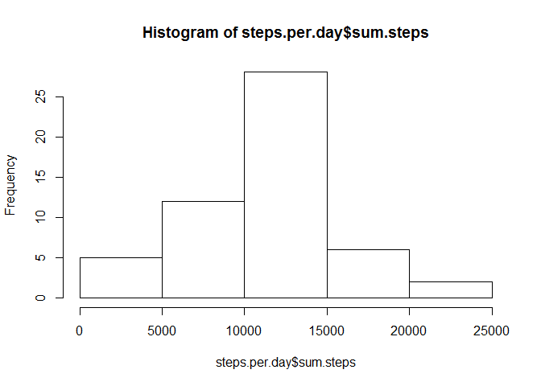
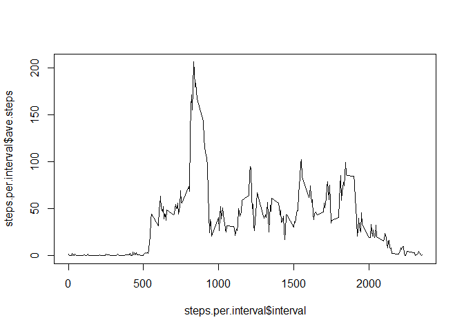
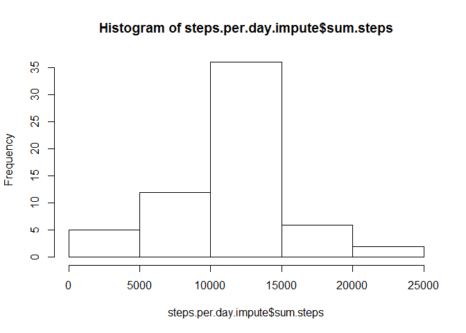
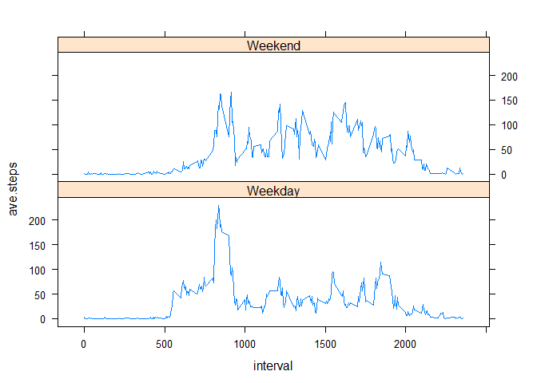

# Reproducible Research: Peer Assessment 1
###Start off by requring the packages being used and setting my working directory

```r
require(knitr)
```

```
## Loading required package: knitr
```

```
## Warning: package 'knitr' was built under R version 3.1.3
```

```r
require(dplyr)
```

```
## Loading required package: dplyr
## 
## Attaching package: 'dplyr'
## 
## The following object is masked from 'package:stats':
## 
##     filter
## 
## The following objects are masked from 'package:base':
## 
##     intersect, setdiff, setequal, union
```

```r
require(lattice)
```

```
## Loading required package: lattice
```

```r
setwd("C:/Users/Lukas/Documents/GitHub/RepData_PeerAssessment1")
options(scipen = 1, digits = 2)
```

## Loading and preprocessing the data
load the data that exists in the working directory and create another data set that has all null values removed

```r
data.load<-read.csv("activity.csv")
no.nulls<-na.omit(data.load)
```

## What is mean total number of steps taken per day?
A histogram of the total number of steps taken each day

```r
steps.per.day<-summarise(group_by(no.nulls,date),sum.steps=sum(steps))
hist(steps.per.day$sum.steps)
```

 

Now, I'll calculate the mean and median total number of steps taken per day

```r
x<-mean(steps.per.day$sum.steps)
y<-median(steps.per.day$sum.steps)
```
the mean is 10766.19 the median is 10765.

## What is the average daily activity pattern?

Plot the average number of steps taken for each 5-minute interval across all days

```r
steps.per.interval<-summarise(group_by(no.nulls,interval),ave.steps=mean(steps))
plot(steps.per.interval$interval,steps.per.interval$ave.steps,type="l")
```

 

```r
z<-steps.per.interval[which(steps.per.interval$ave.steps==max(steps.per.interval$ave.steps)),1]
```
On average, the most steps in a day occure in the 835th 5-minute interval

## Imputing missing values


```r
filled.in<-merge(data.load,steps.per.interval)
missing.rows<-nrow(data.load[is.na(data.load$steps),])
```
There are 2304 missing records

Now we'll impute missing values by assigning the mean for that 5-minute interval where data is not available.
We'll examine the distribution of daily total steps after imputing

```r
imputed.values<-mutate(filled.in, new.steps = ifelse(is.na(steps)==TRUE,ave.steps,steps))
steps.per.day.impute<-summarise(group_by(imputed.values,date),sum.steps=sum(new.steps))
hist(steps.per.day.impute$sum.steps)
```

 

```r
impute.mean<-mean(steps.per.day.impute$sum.steps)
impute.median<-median(steps.per.day.impute$sum.steps)
```
The mean steps for the imputed data is 10766.19.  
The median steps for the imputed data is 10766.19.

## Are there differences in activity patterns between weekdays and weekends?

We'll do some analysis to figure out which records are weekdays and which are weekends.

```r
dayoweek<-ifelse(weekdays(as.Date(imputed.values$date,"%Y-%m-%d")) %in% c("Saturday", "Sunday"),"Weekend","Weekday")
impute.with.days<-mutate(imputed.values,dayofweek=
                         ifelse(
                           weekdays(
                             as.Date(imputed.values$date,"%Y-%m-%d")) 
                           %in% c("Saturday", "Sunday")
                           ,"Weekend"
                           ,"Weekday"
                           )
                         )
Week.compare<-summarise(group_by(impute.with.days,dayofweek,interval),ave.steps=mean(new.steps))
```
Next, we'll check out 2 time seris plots comparing the average steps at each 5 minute interval for weekends and weekdays

```r
xyplot(ave.steps~interval|dayofweek,
       data=Week.compare,
       type="l",
       layout=c(1,2))
```

 
